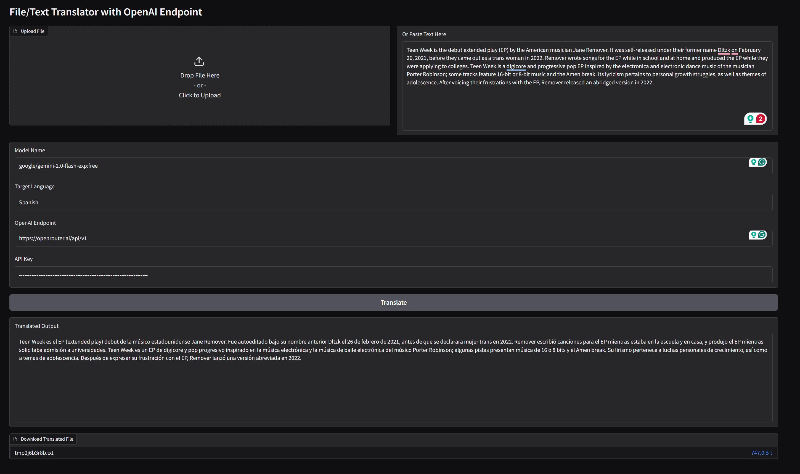

# Name of the component

Add here your badges:
[](http://localhost:8501/launch-component)
[]("")

> [!NOTE]  
> This repository makes use of submodules. Therefore, when cloning it you need to include them.
>  
> `git clone --recurse-submodules https://github.com/odtp-org/odtp-llm-translation`

This component make use of LLM to translate input text or json values. In order to run it you need to provide an LLM openai-compatible endpoint such as https://openrouter.ai. You can get this from a provider or deploy a local instance of llama.

Example of .env variables:
```bash
#ODTP COMPONENT VARIABLES
INPUT_FILE=input.txt
OUTPUT_FILE=output.txt
MODEL_NAME=google/gemini-2.0-flash-exp:free
LANGUAGE=Spanish
ENPOINT=https://openrouter.ai/api/v1
API_KEY=sk-or-v1-0e7************************

# ODTP ENV VARIABLES FOR API MODE
ODTP_API_MODE=FALSE
ODTP_GRADIO_SHARE=FALSE

### OTHER ENV VARIABLES (FALSE/TRUE)
TRANSFER_INPUT_TO_OUTPUT=FALSE
ODTP_SAVE_SNAPSHOT=FALSE
ODTP_SAVE_IN_RESULT=TRUE
ODTP_LOGS_IN_DB=FALSE
```

Also you can use this component as a gradio application:



## Table of Contents

- [Tools Information](#tools-information)
- [How to add this component to your ODTP instance](#how-to-add-this-component-to-your-odtp-instance)
- [Data sheet](#data-sheet)
    - [Parameters](#parameters)
    - [Secrets](#secrets)
    - [Input Files](#input-files)
    - [Output Files](#output-files)
- [Tutorial](#tutorial)
    - [How to run this component as docker](#how-to-run-this-component-as-docker)
    - [Development Mode](#development-mode)
    - [Running in API Mode](#running-in-api-mode)
- [Credits and References](#credits-and-references)

## Tools Information

No external tool used. The logic is in app.

## How to add this component to your ODTP instance

In order to add this component to your ODTP CLI, you can use. If you want to use the component directly, please refer to the docker section. 

``` bash
odtp new odtp-component-entry \
--name odtp-llm-translation \
--component-version v0.0.1 \
--repository http://github.com/caviri/odtp-llm-translation \
--image TBD \
```

## Data sheet

### Parameters

 **TBD**

| Parameter                  | Description                                         | Type    | Required | Default Value | Possible Values         | Constraints |
|----------------------------|-----------------------------------------------------|---------|----------|---------------|------------------------|-------------|
| MODEL_NAME                 | Name of the LLM model to use                        | string  | Yes      | -             | Model names supported  |             |
| LANGUAGE                   | Target language for translation                     | string  | Yes      | -             | Any language           |             |
| ENDPOINT                    | OpenAI-compatible API endpoint                      | string  | Yes      | -             | Valid URL              |             |
| ODTP_API_MODE              | Enable API mode                                     | boolean | No       | FALSE         | TRUE, FALSE            |             |
| ODTP_GRADIO_SHARE          | Enable Gradio share                                 | boolean | No       | FALSE         | TRUE, FALSE            |             |
| TRANSFER_INPUT_TO_OUTPUT   | Copy input directly to output                       | boolean | No       | FALSE         | TRUE, FALSE            |             |
| ODTP_SAVE_SNAPSHOT         | Save a snapshot of the process                      | boolean | No       | FALSE         | TRUE, FALSE            |             |
| ODTP_SAVE_IN_RESULT        | Save translation in result                          | boolean | No       | TRUE          | TRUE, FALSE            |             |
| ODTP_LOGS_IN_DB            | Store logs in database                              | boolean | No       | FALSE         | TRUE, FALSE            |             |

### Secrets

| Secret Name | Description                                 | Type   | Required | Default Value | Constraints | Notes                       |
|-------------|---------------------------------------------|--------|----------|---------------|-------------|-----------------------------|
| API_KEY     | API key for the OpenAI-compatible endpoint  | string | Yes      | -             | Valid key   | Do not share or commit this |

### Input Files

| File/Folder         | Description                | File Type | Required | Format         | Notes |
|--------------------|----------------------------|-----------|----------|---------------|-------|
| odtp-input/input.txt| Input text or JSON values  | text/json | Yes      | Plain/JSON     |       |

### Output Files

| File/Folder          | Description                | File Type | Contents           | Usage |
|---------------------|----------------------------|-----------|--------------------|-------|
| odtp-output/output.txt | Translated output text or JSON | text/json | Translated content | Main result |

## Tutorial

### How to run this component as docker

Build the dockerfile.

``` bash
docker build -t odtp-llm-translation .
```

Run the following command. Mount the correct volumes for input/output/logs folders.

``` bash
docker run -it --rm \
-v {PATH_TO_YOUR_INPUT_VOLUME}:/odtp/odtp-input \
-v {PATH_TO_YOUR_OUTPUT_VOLUME}:/odtp/odtp-output \
-v {PATH_TO_YOUR_LOGS_VOLUME}:/odtp/odtp-logs \
--env-file .env odtp-llm-translation
```

On Windows:

```powershell
docker run -it --rm `
-v ${PWD}/odtp/odtp-input:/odtp/odtp-input `
-v ${PWD}/odtp/odtp-output:/odtp/odtp-output `
-v ${PWD}/odtp/odtp-logs:/odtp/odtp-logs `
--env-file .env odtp-llm-translation
```

### Development Mode

To run the component in development mode, mount the app folder inside the container:

``` bash
docker run -it --rm \
-v {PATH_TO_YOUR_INPUT_VOLUME}:/odtp/odtp-input \
-v {PATH_TO_YOUR_OUTPUT_VOLUME}:/odtp/odtp-output \
-v {PATH_TO_YOUR_LOGS_VOLUME}:/odtp/odtp-logs \
-v {PATH_TO_YOUR_APP_FOLDER}:/odtp/app \
--env-file .env odtp-llm-translation
```


### Running in API Mode

To run the component in API mode and expose a port, use the following command:

``` bash
docker run -it --rm \
-p 7860:7860 \
--env-file .env \
odtp-llm-translation
```

```powershell
docker run -it --rm `
-p 7860:7860 `
--env-file .env `
odtp-llm-translation
```


## Credits and references

Carlos Vivar Rios

This component has been created using the `odtp-component-template` `v0.5.0`.